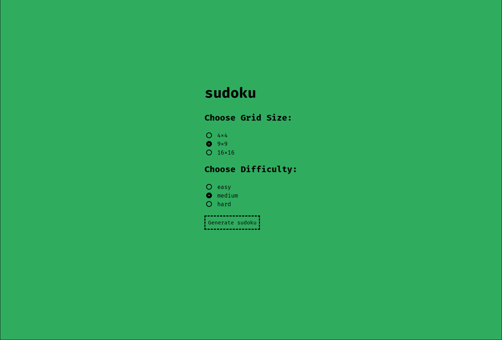
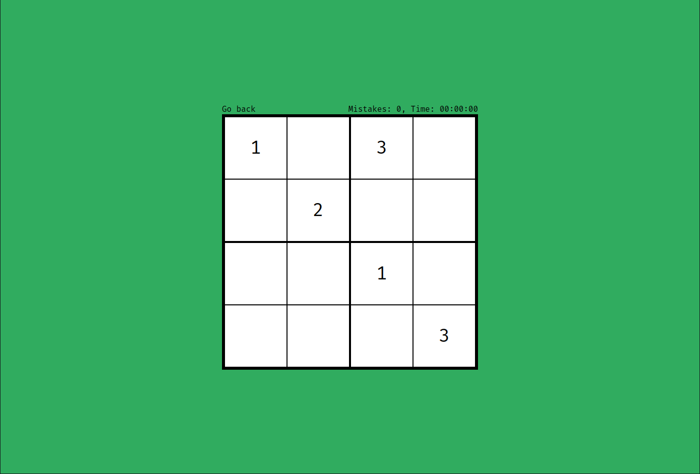
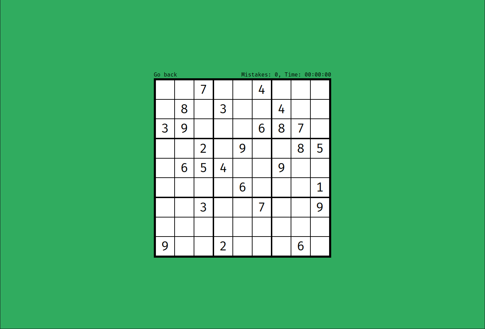
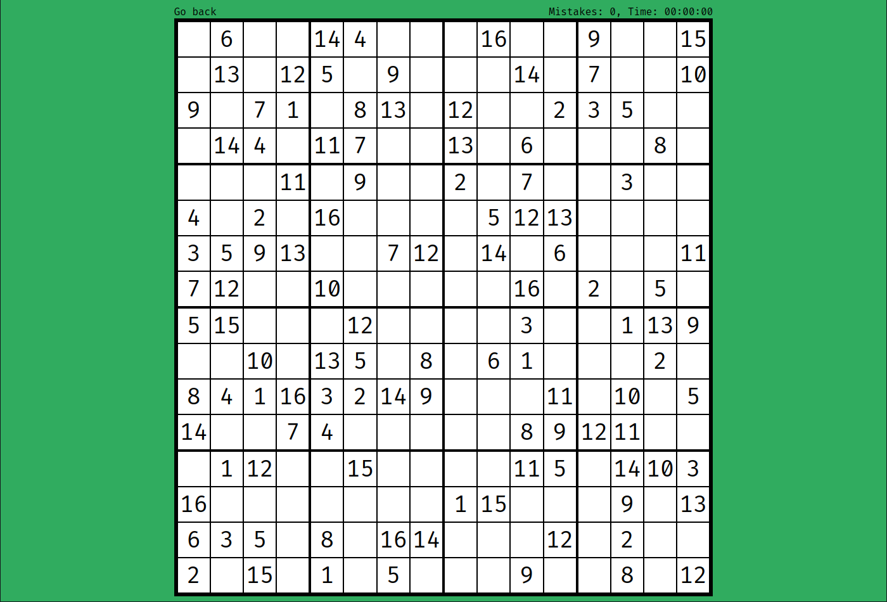
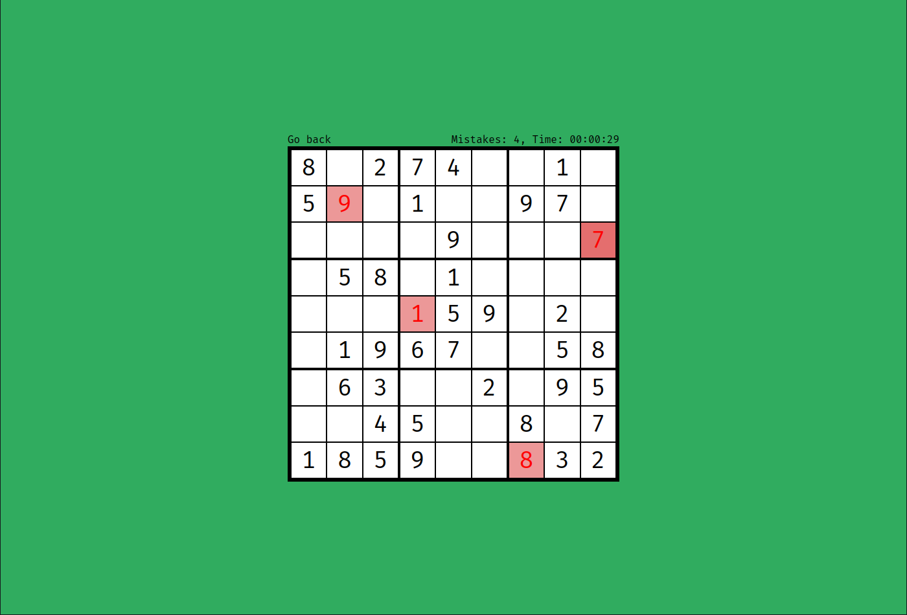
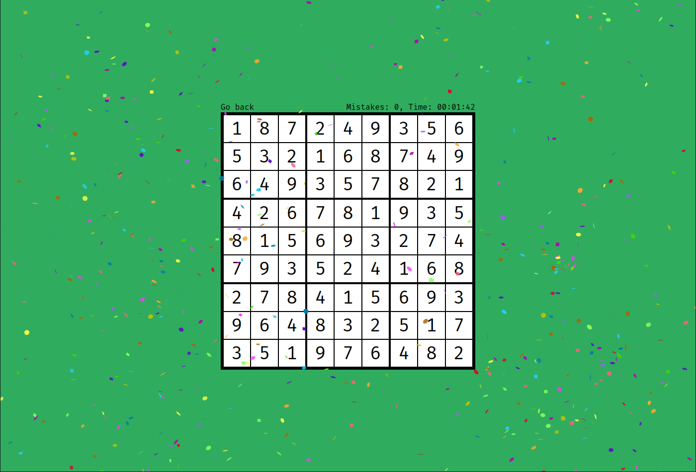

# sudoku-generator

Simple Sudoku grid generator, allowing to gererate 4x4, 9x9 and 16x16 Sudoku's. It also provides a user-friendly interface allowing generating and playing Sudoku.

# Algorythm Overview

### 1. Generating fully filled array

First, program generates n*n array (where n is corresponds to the size of grid) filled with appropriate numbers satisfying Sudoku requirements. It is implemented by using Bactracking algorythm, which tries to fill 2D array with random numbers, and if it fails, it takes a step back and changes previously put number and tries again (if it fails again it changes a number put two steps ago, then three and so on).

**Time Complexity:** O(N^(n*n)) - where N is number of possible numbers in a Sudoku box (for 4x4 it is 4, for 9x9 it is 9)

**Space Complexity:** O(n^2) 

### 2. Sudoku solver

To generate proper Sudoku grid, program needs to recognise if given grid is solvable and its solution is unique. For this reason this sudoku-generator is equipped with a solver. It also uses Backtracking approach. Sudoku solver fills empty boxes with consecutive numbers (which doesn't violate Sudoku rules) and tries to fill entire grid in such manner. If it succedes and succedes only once (there is only one unique solution), Sudoku grid can be considered valid.

**Time Complexity:** O(N^(n*n))

**Space Complexity:** O(n^2) 

### 3. Generating Sudoku grid with empty boxes

The last step is to take a random box from fully filled array, empty it, and run Sudoku solver. If thus created grid is unsolvable, algorythm puts the value it took away back in the grid. The whole process is repeated a number of times. The more times we run this step on a Sudoku grid, the more difficult to solve it becomes.

**Time Complexity:** O(N^(n*n))

**Space Complexity:** O(n^2) 

References: 

https://www.geeksforgeeks.org/sudoku-backtracking-7/

https://www.101computing.net/sudoku-generator-algorithm/

https://www.101computing.net/backtracking-algorithm-sudoku-solver/

# Page overview with screenshots

## Options menu:

## 4x4 grid:

## 9x9 grid:

## 16x16 grid:

## Gameplay:

The page keeps track of your time and mistakes you made.

## Fireworks:

If you manage to fill the entire Sudoku grid, the page applauds you with fireworks and confetti. The effect was possible thanks to [tsParticles](https://particles.js.org).

# What can be improved

I made this sudoku grid generator back in 2021 (and this repository is jsut a remake of orginal project), when I didn't had the best knowledge of data structures and time complexity. If I were to make it today, I would use TypedArray data structure (e.g Int8Array) instead of JavaScript dymanic arrays. It would significantly speed the generator up (especially when generating big and difficult grids).
